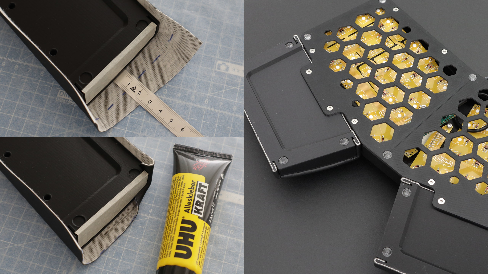

Chrumm keyboard
===============

Chrumm is an open-hardware ergonomic keyboard,
made of a 3D-printable body, a bendable PCB,
and custom firmware for the Raspberry Pi Pico.

This repository contains all relevant source files.
The generated files can be downloaded from the [releases] page.
Additional documentation for each component can be
found in the respective subdirectories.

I share these files in the hope that they are useful, or
at least interesting to others. Keep in mind that this is
a free, do-it-yourself project. What you see is what you get.
Make sure to check the license.

[releases]: https://github.com/sevmeyer/chrumm-keyboard/releases/

Features
--------

Chrumm features a column staggered layout with simple thumb clusters.
The right side has an additional column, to better approximate
the standard ANSI layout, and to provide dedicated arrow keys.
A central encoder allows for rotational input.

The body is a robust monoblock without visible screws. It has
integrated split, tent, and tilt angles, similar to commercial
ergonomic boards. The palm rests and the USB cable are firmly
attached, so that everything can be moved around without hassle.

The STL files are generated programmatically, with a pure
Python package that has no dependencies. They are optimized
for FFF 3D printing. Most parts are printed sideways, to
produce a smooth surface without the need of post-processing.
Custom supports minimize the print time and filament cost.

The body houses two reversible, bendable, interconnected PCBs.
They are powered by a Raspberry Pi Pico.

Credit
------

Chrumm would not exist without the shared knowledge of the
mechanical keyboard community.

I found inspiration on [Reddit], [KBD.news], [geekhack], and
learned a lot from the [PCB guides] by ai03 and Ruiqi Mao, the
[Keyboard posts] by Masterzen, and the [Matrix Help] by Dave Dribin.

The layout and body is influenced by projects like the [Ergodox],
[Dactyl], [Sofle], [Pteron], and everything from [Bastardkb].
I also used established open hardware repositories for reference,
including the [UHK60], [Skeletyl], [Sofle], [Corne], and [Torn].

[Reddit]: https://old.reddit.com/r/ErgoMechKeyboards+MechanicalKeyboards/
[KBD.news]: https://kbd.news/
[geekhack]: https://geekhack.org
[PCB guides]: https://wiki.ai03.com/books/pcb-design
[Keyboard posts]: https://www.masterzen.fr/tag/#mechanical-keyboards
[Matrix Help]: https://www.dribin.org/dave/keyboard/one_html/
[Ergodox]: https://www.ergodox.io/
[Dactyl]: https://github.com/adereth/dactyl-keyboard
[Sofle]: https://github.com/josefadamcik/SofleKeyboard
[Pteron]: https://github.com/FSund/pteron-keyboard
[Bastardkb]: https://bastardkb.com/
[UHK60]: https://github.com/UltimateHackingKeyboard/uhk60v1-electronics
[Skeletyl]: https://github.com/Bastardkb/Skeletyl-PCB-plate
[Corne]: https://github.com/foostan/crkbd
[Torn]: https://github.com/rtitmuss/torn

Layout
------

Material
--------

Mechanical:

- 12x Threaded insert, M3, 4mm hole diameter, max 5.7mm length
- 12x Countersunk screw, M3, 8mm total length, ISO 10642
-  7x Hex nut with nylon insert, M3, ISO 10511
-  2x Hex nut with nylon insert, M2
-  7x Socket head cap screw, M3, 8mm thread length, ISO 4762 (*)
-  2x Socket head cap screw, M2, 6mm thread length, ISO 4762
-  2x Ziptie, 2mm width, 1mm thickness
- 14x 3M Bumpon SJ5302, hemispherical, 8mm diameter, 2mm height
-  2x Artificial leather, ~190x130mm, max 1.2mm thickness
- Glue for artificial leather on printed filament
- Keycaps (photo: Akko WOB Building Blocks, MDA profile)

Electronic:

-  2x PCB
-  1x Raspberry Pi Pico, SC0915, without pre-soldered headers
-  1x USB cable, A to micro-B with small head, shielded, max 4mm diameter
- 64x Diode, 1N4148, DO-35 through-hole format
- 64x MX switch
-  1x Bourns PEC11R-4215F-N0024 rotary encoder, M7 nut mount, 15mm flatted D-shaft
-  1x TE Flexstrip FSN-22A-8, 0.1" pitch, 2" length, 8 conductors (**)
-  1x TE Flexstrip FSN-22A-5, 0.1" pitch, 2" length, 5 conductors (**)
-  1x TE Flexstrip FSN-23A-3, 0.1" pitch, 3" length, 3 conductors (**)

(*) Some of the screws are difficult to reach and
require a ball-point driver, or a short-armed key.

(**) It might be cheaper to buy strips with
more conductors and cut them apart as needed.

see the convenient [shopping list](SHOPPING_LIST.md) for details.

Images
------

